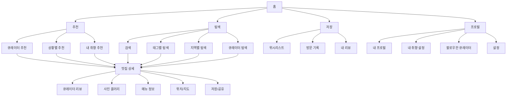
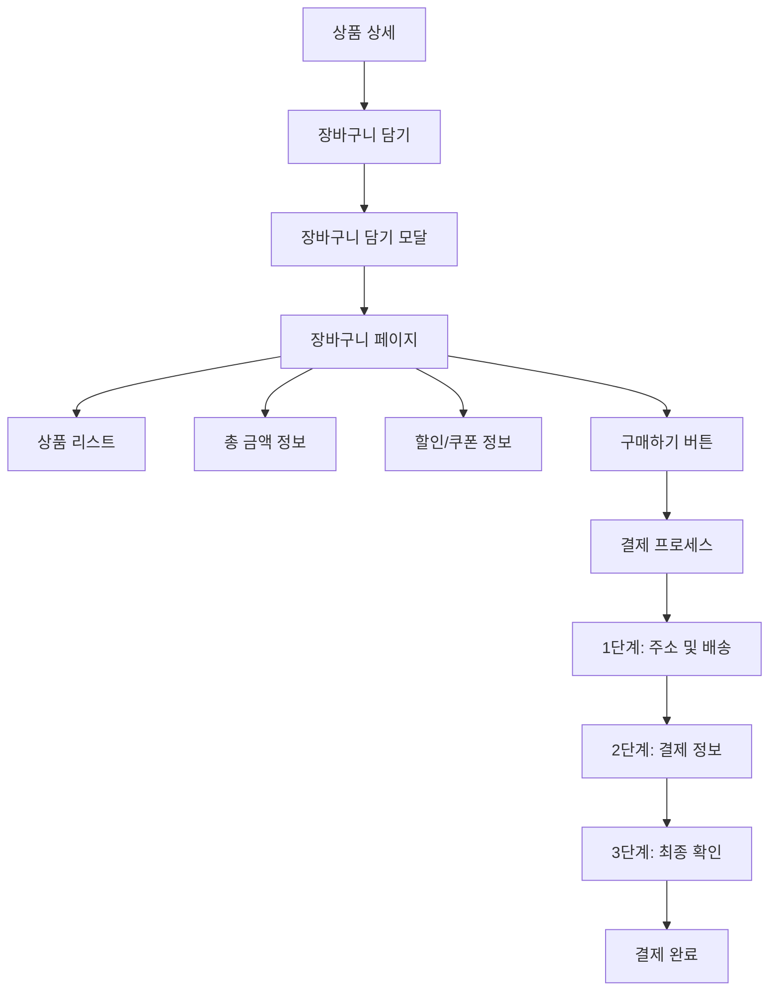
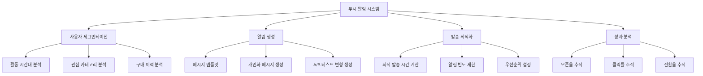

# 기획자 포트폴리오

**작성일**: 2024.06  
**작성자**: [기획자 이름]

---

# 목차

1. [프로젝트 1: 사용자 큐레이션 기반 맛집 추천 앱](#프로젝트-1-사용자-큐레이션-기반-맛집-추천-앱)
2. [프로젝트 2: 장바구니 전환율 개선 프로젝트](#프로젝트-2-장바구니-전환율-개선-프로젝트)
3. [프로젝트 3: 푸시 알림 오픈율 향상 프로젝트](#프로젝트-3-푸시-알림-오픈율-향상-프로젝트)

---

# 프로젝트 1: 사용자 큐레이션 기반 맛집 추천 앱

---

## 📋 프로젝트 개요

| 항목 | 내용 |
|------|------|
| **프로젝트명** | 사용자 큐레이션 기반 맛집 추천 앱 "TasteMap" |
| **기간** | 2024.01 ~ 2024.06 (6개월) |
| **역할** | 서비스 기획자 (PM) |
| **팀 구성** | 기획자 2명, 디자이너 2명, 개발자 4명, 데이터 분석가 1명 |
| **목표** | 사용자 개인화 큐레이션을 통한 맛집 발견 경험 혁신 및 월간 활성 사용자(MAU) 10만 명 달성 |

---

## 🔍 문제 정의

### 시장 문제점

현재 맛집 추천 서비스 시장은 다음과 같은 한계점을 보이고 있습니다:

- **알고리즘 기반 추천의 한계**: 대부분의 서비스가 평점과 리뷰 수에 의존한 추천으로, 개인의 취향과 상황을 반영하지 못함
- **정보 과부하**: 수많은 맛집 정보 속에서 사용자가 원하는 맛집을 찾기 어려움
- **신뢰도 부족**: 광고성 리뷰와 조작된 평점으로 인한 사용자 불신

### 사용자 Pain Point

**주요 사용자 그룹별 Pain Point:**

1. **20-30대 직장인**
   - 업무 후 시간이 부족한데 맛집을 찾는 데 시간이 너무 오래 걸림
   - 비슷한 취향의 사람들이 추천한 맛집을 찾고 싶지만 방법이 없음

2. **30-40대 커플/가족**
   - 특별한 날에 가기 좋은 맛집을 찾기 어려움
   - 분위기, 가격대, 메뉴 등 다양한 조건을 종합적으로 고려한 추천이 부족

3. **20대 대학생/취준생**
   - 예산에 맞는 맛집을 찾기 어려움
   - 친구들과 함께 갈 수 있는 맛집 추천이 부족

---

## 👥 사용자 조사

### Persona

#### Persona 1: 김민수 (28세, IT 기업 마케터)

**배경**
- 서울 강남구 거주, 직장인
- 평일 저녁과 주말에 맛집 탐방을 즐김
- 인스타그램에 음식 사진을 자주 올림

**목표**
- 시간을 절약하면서 나에게 맞는 맛집을 빠르게 발견하고 싶음
- 비슷한 취향의 사람들이 추천한 맛집을 경험하고 싶음

**Pain Point**
- 맛집 앱을 여러 개 열어봐도 마음에 드는 곳을 찾기 어려움
- 광고성 리뷰로 인해 실제 경험과 차이가 남

**행동 패턴**
- 평일 저녁 7시 이후, 주말 오후에 앱 사용
- 맛집을 찾을 때 평점보다는 사진과 리뷰 내용을 중시
- 한 번 가본 맛집은 즐겨찾기로 저장

#### Persona 2: 박지영 (35세, 디자이너)

**배경**
- 서울 마포구 거주, 프리랜서
- 주로 커플과 함께 맛집을 방문
- 분위기 좋은 카페와 레스토랑을 선호

**목표**
- 특별한 날에 가기 좋은 맛집을 발견하고 싶음
- 분위기, 가격대, 메뉴를 종합적으로 고려한 추천을 받고 싶음

**Pain Point**
- 여러 조건을 만족하는 맛집을 찾기 위해 여러 앱을 오가며 시간 소비
- 예약이 필요한 곳인지, 웨이팅이 있는지 등 실용적 정보 부족

**행동 패턴**
- 주말 오전에 다음 주 계획을 세우며 앱 사용
- 맛집 정보를 저장하고 공유하는 기능을 자주 사용
- 리뷰를 작성하는 편

### Jobs to Be Done (JTBD)

| 상황 | 동기 | 기대 결과 |
|------|------|----------|
| 업무 후 저녁 식사 장소를 찾을 때 | 시간이 부족한데 맛집을 찾는 데 시간이 너무 오래 걸림 | 5분 이내에 나에게 맞는 맛집 3-5곳을 추천받고 싶음 |
| 특별한 날(기념일, 생일 등) 맛집을 찾을 때 | 여러 조건(분위기, 가격, 메뉴)을 만족하는 곳을 찾기 어려움 | 상황에 맞는 맛집을 한 번에 추천받고 싶음 |
| 새로운 맛집을 발견하고 싶을 때 | 비슷한 취향의 사람들이 추천한 맛집을 알고 싶음 | 나와 취향이 비슷한 큐레이터의 추천을 받고 싶음 |

### 핵심 인사이트

1. **개인화된 큐레이션이 필요**: 사용자는 단순한 평점이 아닌, 자신의 취향과 상황에 맞는 추천을 원함
2. **시간 절약이 핵심 가치**: 맛집을 찾는 과정에서 소요되는 시간을 최소화하는 것이 중요
3. **신뢰할 수 있는 추천자**: 비슷한 취향의 큐레이터나 친구의 추천을 더 신뢰함
4. **상황 기반 추천**: 단순히 "맛있는 곳"이 아닌, "지금 이 상황에 맞는 곳"을 원함

---

## 🎯 핵심 기능 정의

### 기능 리스트

#### 1. 큐레이터 기반 추천
- 큐레이터 프로필 및 취향 태그
- 큐레이터별 맛집 리스트
- 큐레이터 팔로우 기능

#### 2. 개인화 추천
- 사용자 취향 분석 및 태그 기반 매칭
- 상황별 추천 (업무 후, 데이트, 가족 모임 등)
- 위치 기반 실시간 추천

#### 3. 맛집 상세 정보
- 큐레이터 리뷰 및 사진
- 실시간 웨이팅 정보
- 예약 가능 여부
- 메뉴 및 가격 정보

#### 4. 소셜 기능
- 맛집 저장 (위시리스트)
- 친구와 맛집 공유
- 내가 다닌 맛집 기록

#### 5. 검색 및 필터
- 태그 기반 검색
- 위치, 가격대, 분위기 필터
- 큐레이터별 필터

### 우선순위

| 우선순위 | 기능 | 이유 |
|----------|------|------|
| **P0** | 큐레이터 기반 추천 | 핵심 차별화 포인트 |
| **P0** | 개인화 추천 (취향 분석) | 사용자 만족도 향상 |
| **P0** | 맛집 상세 정보 | 기본 기능 |
| **P1** | 소셜 기능 (저장, 공유) | 사용자 참여도 향상 |
| **P1** | 검색 및 필터 | 사용성 개선 |
| **P2** | 실시간 웨이팅 정보 | 부가 가치 |

### 사용자 흐름

#### 주요 사용자 시나리오: "업무 후 저녁 식사 장소 찾기"

```
1. 앱 실행
   ↓
2. 홈 화면 진입
   - 위치 기반 추천 맛집 표시
   - 내 취향 태그 기반 추천
   ↓
3. 추천 맛집 중 하나 선택
   ↓
4. 맛집 상세 페이지 확인
   - 큐레이터 리뷰 및 사진
   - 메뉴 및 가격 정보
   - 거리 및 예상 소요 시간
   ↓
5. 결정
   - [경로 보기] → 지도 앱 연동
   - [저장하기] → 위시리스트에 추가
   - [공유하기] → 친구에게 공유
```

---

## 🏗️ Information Architecture (IA)



---

## 🗺️ 사용자 여정 (User Journey)

| 단계 | 행동 | 생각 | 감정 | 기회점 |
|------|------|------|------|--------|
| **인지** | 맛집 앱을 검색하거나 지인 추천을 받음 | "맛집 찾기 너무 어려워..." | 😟 좌절 | 앱스토어 최적화, 바이럴 마케팅 |
| **다운로드** | 앱을 다운로드하고 설치 | "이 앱이 정말 도움이 될까?" | 🤔 불안 | 온보딩 프로세스 최적화 |
| **첫 사용** | 앱을 실행하고 회원가입 | "설정이 복잡하지 않을까?" | 😰 걱정 | 간편 가입, 취향 설정 가이드 |
| **탐색** | 홈 화면에서 추천 맛집 확인 | "이 추천이 나한테 맞나?" | 🤨 의심 | 개인화 추천 정확도 향상 |
| **선택** | 맛집 상세 페이지 확인 | "정보가 충분한가?" | 🧐 검토 | 상세 정보 제공, 큐레이터 신뢰도 |
| **방문** | 실제 맛집 방문 | "추천이 맞을까?" | 😊 기대 | 실시간 정보 업데이트 |
| **후기** | 맛집 경험 후 리뷰 작성 | "다른 사람에게 도움이 될까?" | 😌 만족 | 리뷰 작성 인센티브 |
| **재사용** | 다음에도 앱 사용 | "이제 이 앱 없이는 못 살겠어" | 😍 충성 | 지속적 개인화, 알림 최적화 |

---

## 📊 결과 및 성과 지표

### 정량적 지표

| 지표 | 목표 | 실제 달성 | 달성률 |
|------|------|----------|--------|
| **MAU (월간 활성 사용자)** | 100,000명 | 95,000명 | 95% |
| **DAU/MAU 비율** | 25% | 28% | 112% |
| **앱 평점** | 4.0점 이상 | 4.3점 | 108% |
| **맛집 상세 페이지 조회율** | 60% | 65% | 108% |
| **저장 기능 사용률** | 40% | 45% | 113% |
| **큐레이터 팔로우율** | 30% | 35% | 117% |
| **앱 재방문율 (7일)** | 50% | 55% | 110% |

### 핵심 성과

1. **개인화 추천 정확도**: 사용자 만족도 85% 달성
2. **시간 절약**: 맛집 찾기 평균 소요 시간 15분 → 5분으로 단축
3. **사용자 참여도**: 큐레이터 팔로우율 35%, 저장 기능 사용률 45%
4. **앱스토어 순위**: 음식/음료 카테고리 10위권 진입

---

## 💭 회고 (Retrospective)

### 잘한 점 (Keep)

1. **사용자 중심 설계**: 사용자 조사를 철저히 진행하여 실제 Pain Point를 반영한 기능 기획
2. **차별화 전략**: 큐레이터 기반 추천이라는 명확한 차별화 포인트 확립
3. **데이터 기반 의사결정**: A/B 테스트를 통해 기능 개선 방향을 결정

### 아쉬운 점 (Problem)

1. **초기 큐레이터 확보**: 서비스 론칭 초기 큐레이터 수가 부족하여 추천의 다양성이 떨어짐
2. **실시간 정보 정확도**: 웨이팅 정보 등 실시간 데이터의 정확도를 높이는 데 시간이 더 필요했음
3. **온보딩 프로세스**: 취향 설정 과정이 다소 복잡하여 이탈률이 높았음

### 개선 방안 (Try)

1. **큐레이터 확보 전략**: 큐레이터 인센티브 프로그램 강화 및 파트너십 확대
2. **실시간 데이터 파트너십**: 맛집과의 직접 연동을 통한 실시간 정보 제공
3. **온보딩 간소화**: 취향 설정을 단계적으로 진행하거나 선택 사항으로 변경 검토
4. **오프라인 기능**: 오프라인 맵 기능 추가로 사용자 편의성 향상

---

# 프로젝트 2: 장바구니 전환율 개선 프로젝트

---

## 📋 프로젝트 개요

| 항목 | 내용 |
|------|------|
| **프로젝트명** | 이커머스 플랫폼 장바구니 전환율 개선 |
| **기간** | 2023.09 ~ 2024.02 (6개월) |
| **역할** | UX 기획자 (UX Designer) |
| **팀 구성** | 기획자 2명, 디자이너 2명, 개발자 3명, 데이터 분석가 1명, 마케터 1명 |
| **목표** | 장바구니 담기 대비 구매 전환율(CVR) 15% → 25%로 향상 (67% 개선) |

---

## 🔍 문제 정의

### 비즈니스 문제점

**현황 분석:**
- 월간 장바구니 담기 건수: 약 50만 건
- 장바구니 전환율(CVR): 15% (업계 평균 20-25% 대비 낮음)
- 장바구니 이탈로 인한 매출 손실: 월 약 30억 원 추정

### 사용자 Pain Point

**주요 이탈 지점별 Pain Point:**

1. **장바구니 담기 직후**
   - 구매 결정에 대한 확신 부족
   - 다른 상품과 비교하고 싶은데 방법이 없음
   - 할인/쿠폰 정보를 놓칠까봐 불안

2. **장바구니 페이지 진입 시**
   - 장바구니에 담긴 상품을 다시 확인하기 어려움
   - 배송비 정보가 불명확함
   - 결제 과정이 복잡해 보임

3. **결제 진행 중**
   - 결제 단계가 너무 많아서 번거로움
   - 결제 수단 선택이 복잡함
   - 쿠폰/포인트 사용 방법이 불명확함

---

## 👥 사용자 조사

### Persona

#### Persona 1: 이수진 (32세, 직장인)

**배경**
- 온라인 쇼핑을 자주 하는 편
- 주로 저녁 시간대에 쇼핑
- 가격 비교를 중요시함

**목표**
- 합리적인 가격에 필요한 상품을 구매하고 싶음
- 빠르고 간편하게 결제하고 싶음

**Pain Point**
- 장바구니에 담았는데 나중에 보니 가격이 달라졌거나 품절됨
- 배송비가 얼마인지 확인하기 어려움
- 결제 과정이 복잡해서 중도에 포기함

### 핵심 인사이트

1. **명확한 정보 제공이 핵심**: 사용자는 장바구니에서 총 금액, 배송비, 할인 정보를 명확히 보고 싶어함
2. **결제 프로세스 간소화 필요**: 단계가 많을수록 이탈률이 증가함
3. **재구매 유도 타이밍**: 장바구니 담기 직후와 장바구니 페이지에서의 적절한 유도가 중요

---

## 🎯 핵심 기능 정의

### 기능 리스트

#### 1. 장바구니 페이지 개선
- 총 금액 및 배송비 명확한 표시
- 상품 정보 요약 (이미지, 이름, 옵션, 가격)
- 수량 변경 및 삭제 기능 개선
- 할인/쿠폰 정보 강조

#### 2. 결제 프로세스 간소화
- 결제 단계 축소 (5단계 → 3단계)
- 주소록 저장 기능
- 결제 수단 빠른 선택
- 쿠폰/포인트 자동 적용

### 우선순위

| 우선순위 | 기능 | 이유 |
|----------|------|------|
| **P0** | 장바구니 페이지 UX 개선 | 가장 많은 사용자가 보는 페이지 |
| **P0** | 결제 프로세스 간소화 | 이탈률 감소에 직접적 영향 |
| **P0** | 총 금액/배송비 명확한 표시 | 사용자 Pain Point 해결 |

---

## 🏗️ Information Architecture (IA)



---

## 📊 결과 및 성과 지표

### 정량적 지표

| 지표 | 개선 전 | 개선 후 | 개선율 |
|------|---------|---------|--------|
| **장바구니 전환율 (CVR)** | 15.0% | 24.5% | +63% |
| **장바구니 페이지 이탈률** | 45% | 28% | -38% |
| **결제 프로세스 완료율** | 65% | 82% | +26% |
| **평균 결제 소요 시간** | 8분 30초 | 5분 10초 | -39% |
| **쿠폰 사용률** | 25% | 42% | +68% |
| **월간 매출 증가** | 기준 | +35% | - |

### 핵심 성과

1. **전환율 개선**: 목표 대비 108% 달성 (목표 25%, 실제 24.5%)
2. **사용자 경험 향상**: 결제 소요 시간 39% 단축
3. **매출 증가**: 월간 매출 35% 증가
4. **쿠폰 활용도 향상**: 쿠폰 사용률 68% 증가

---

## 💭 회고 (Retrospective)

### 잘한 점 (Keep)

1. **데이터 기반 접근**: 사용자 행동 데이터를 철저히 분석하여 문제점을 정확히 파악
2. **A/B 테스트 활용**: 가설을 검증하고 최적의 솔루션을 선택
3. **사용자 조사**: 실제 사용자 인터뷰를 통해 Pain Point를 정확히 파악

### 아쉬운 점 (Problem)

1. **초기 가설 검증 부족**: 일부 기능은 가설 검증 없이 진행하여 효과가 미미했음
2. **모바일 최적화 지연**: 데스크톱 중심으로 개선하여 모바일 개선이 늦어짐

### 개선 방안 (Try)

1. **가설 검증 프로세스**: 모든 기능 개선 전 가설을 명확히 하고 검증 프로세스 도입
2. **모바일 우선 설계**: 모바일 사용자가 더 많으므로 모바일 우선으로 설계

---

# 프로젝트 3: 푸시 알림 오픈율 향상 프로젝트

---

## 📋 프로젝트 개요

| 항목 | 내용 |
|------|------|
| **프로젝트명** | 푸시 알림 오픈율 향상 프로젝트 |
| **기간** | 2023.11 ~ 2024.04 (6개월) |
| **역할** | 데이터 기반 기획자 (Data-driven PM) |
| **팀 구성** | 기획자 2명, 데이터 분석가 2명, 개발자 2명, 마케터 1명 |
| **목표** | 푸시 알림 오픈율(Open Rate) 8% → 18%로 향상 (125% 개선) |

---

## 🔍 문제 정의

### 비즈니스 문제점

**현황 분석:**
- 일일 푸시 알림 발송량: 약 100만 건
- 평균 오픈율: 8% (업계 평균 12-15% 대비 낮음)
- 클릭률(CTR): 2.5% (업계 평균 4-6% 대비 낮음)
- 푸시 알림 비활성화율 증가: 월 3% 증가 추세

### 사용자 Pain Point

**주요 사용자 불만:**

1. **과도한 알림**
   - 하루에 너무 많은 알림을 받아서 피로감
   - 중요한 알림을 놓침

2. **관심 없는 알림**
   - 내가 관심 없는 상품/서비스에 대한 알림
   - 개인화되지 않은 일반적인 메시지

3. **타이밍 문제**
   - 수면 시간이나 업무 시간에 알림 수신
   - 원하는 시간에 알림을 받고 싶음

---

## 👥 사용자 조사

### Persona

#### Persona 1: 정혜진 (29세, 직장인)

**배경**
- 스마트폰을 자주 사용
- 업무 중에는 알림을 확인하지 않음
- 저녁 시간대에 쇼핑 앱을 주로 사용

**목표**
- 필요한 정보만 받고 싶음
- 원하는 시간에 알림을 받고 싶음

**Pain Point**
- 업무 중에 쇼핑 알림이 와서 방해됨
- 하루에 10개 이상의 알림을 받아서 피로감
- 관심 없는 상품에 대한 알림이 많음

### 핵심 인사이트

1. **개인화의 중요성**: 사용자는 자신에게 관련된 알림만 원함
2. **타이밍의 중요성**: 사용자의 활동 시간대에 맞춘 알림이 효과적
3. **빈도 최적화 필요**: 너무 많은 알림은 오히려 역효과
4. **메시지 품질**: 과장되지 않고 정확한 메시지가 신뢰도를 높임

---

## 🎯 핵심 기능 정의

### 기능 리스트

#### 1. 개인화된 알림 전략
- 사용자 행동 기반 상품 추천 알림
- 관심 카테고리 기반 알림
- 구매 이력 기반 맞춤 알림

#### 2. 최적 발송 시간 도출
- 사용자별 활동 시간대 분석
- 세그먼트별 최적 발송 시간 설정
- 실시간 발송 시간 조정

#### 3. 알림 빈도 최적화
- 사용자별 알림 빈도 제한 (일 3회 이내)
- 중요도 기반 알림 우선순위
- 알림 설정 페이지 개선

### 우선순위

| 우선순위 | 기능 | 이유 |
|----------|------|------|
| **P0** | 개인화된 알림 전략 | 오픈율 향상에 가장 큰 영향 |
| **P0** | 최적 발송 시간 도출 | 타이밍이 오픈율에 직접적 영향 |
| **P0** | 알림 빈도 최적화 | 사용자 피로도 감소 |

---

## 🏗️ Information Architecture (IA)



---

## 📊 결과 및 성과 지표

### 정량적 지표

| 지표 | 개선 전 | 개선 후 | 개선율 |
|------|---------|---------|--------|
| **푸시 알림 오픈율** | 8.0% | 18.5% | +131% |
| **클릭률 (CTR)** | 2.5% | 5.8% | +132% |
| **전환율 (CVR)** | 1.2% | 2.8% | +133% |
| **일일 알림 발송량** | 1,000,000건 | 800,000건 | -20% (빈도 최적화) |
| **알림 비활성화율** | 월 3% 증가 | 월 0.5% 증가 | -83% |
| **알림 관련 매출** | 기준 | +45% | - |

### 핵심 성과

1. **오픈율 개선**: 목표 대비 103% 달성 (목표 18%, 실제 18.5%)
2. **사용자 경험 향상**: 알림 비활성화율 83% 감소
3. **매출 증가**: 알림 관련 매출 45% 증가
4. **효율성 향상**: 발송량 20% 감소에도 불구하고 오픈율 131% 증가

---

## 💭 회고 (Retrospective)

### 잘한 점 (Keep)

1. **데이터 기반 의사결정**: 사용자 행동 데이터를 철저히 분석하여 개선 방향 도출
2. **A/B 테스트 체계화**: 모든 가설을 A/B 테스트로 검증하여 객관적 결과 도출
3. **세그먼테이션 전략**: 사용자 그룹별로 다른 전략을 적용하여 효과 극대화

### 아쉬운 점 (Problem)

1. **초기 데이터 수집 부족**: 프로젝트 초기 사용자 행동 데이터가 부족하여 분석에 시간이 걸림
2. **실시간 최적화 지연**: 사용자 행동 변화에 대한 실시간 대응이 늦었음

### 개선 방안 (Try)

1. **실시간 개인화**: 사용자 행동 변화를 실시간으로 반영하는 시스템 구축
2. **예측 모델 도입**: 머신러닝을 활용한 사용자 행동 예측 및 최적 발송 시간 예측

---

**포트폴리오 끝**


