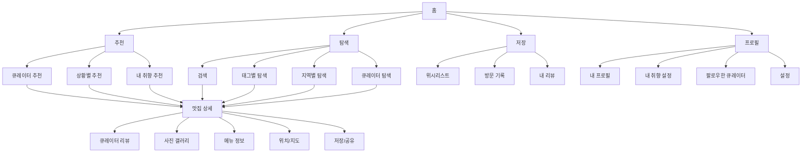

# 프로젝트 1: 사용자 큐레이션 기반 맛집 추천 앱

---

## 📋 프로젝트 개요

| 항목 | 내용 |
|------|------|
| **프로젝트명** | 사용자 큐레이션 기반 맛집 추천 앱 "TasteMap" |
| **기간** | 2024.01 ~ 2024.06 (6개월) |
| **역할** | 서비스 기획자 (PM) |
| **팀 구성** | 기획자 2명, 디자이너 2명, 개발자 4명, 데이터 분석가 1명 |
| **목표** | 사용자 개인화 큐레이션을 통한 맛집 발견 경험 혁신 및 월간 활성 사용자(MAU) 10만 명 달성 |

---

## 🔍 문제 정의

### 시장 문제점

현재 맛집 추천 서비스 시장은 다음과 같은 한계점을 보이고 있습니다:

- **알고리즘 기반 추천의 한계**: 대부분의 서비스가 평점과 리뷰 수에 의존한 추천으로, 개인의 취향과 상황을 반영하지 못함
- **정보 과부하**: 수많은 맛집 정보 속에서 사용자가 원하는 맛집을 찾기 어려움
- **신뢰도 부족**: 광고성 리뷰와 조작된 평점으로 인한 사용자 불신

### 사용자 Pain Point

**주요 사용자 그룹별 Pain Point:**

1. **20-30대 직장인**
   - 업무 후 시간이 부족한데 맛집을 찾는 데 시간이 너무 오래 걸림
   - 비슷한 취향의 사람들이 추천한 맛집을 찾고 싶지만 방법이 없음

2. **30-40대 커플/가족**
   - 특별한 날에 가기 좋은 맛집을 찾기 어려움
   - 분위기, 가격대, 메뉴 등 다양한 조건을 종합적으로 고려한 추천이 부족

3. **20대 대학생/취준생**
   - 예산에 맞는 맛집을 찾기 어려움
   - 친구들과 함께 갈 수 있는 맛집 추천이 부족

---

## 👥 사용자 조사

### Persona

#### Persona 1: 김민수 (28세, IT 기업 마케터)

**배경**
- 서울 강남구 거주, 직장인
- 평일 저녁과 주말에 맛집 탐방을 즐김
- 인스타그램에 음식 사진을 자주 올림

**목표**
- 시간을 절약하면서 나에게 맞는 맛집을 빠르게 발견하고 싶음
- 비슷한 취향의 사람들이 추천한 맛집을 경험하고 싶음

**Pain Point**
- 맛집 앱을 여러 개 열어봐도 마음에 드는 곳을 찾기 어려움
- 광고성 리뷰로 인해 실제 경험과 차이가 남

**행동 패턴**
- 평일 저녁 7시 이후, 주말 오후에 앱 사용
- 맛집을 찾을 때 평점보다는 사진과 리뷰 내용을 중시
- 한 번 가본 맛집은 즐겨찾기로 저장

#### Persona 2: 박지영 (35세, 디자이너)

**배경**
- 서울 마포구 거주, 프리랜서
- 주로 커플과 함께 맛집을 방문
- 분위기 좋은 카페와 레스토랑을 선호

**목표**
- 특별한 날에 가기 좋은 맛집을 발견하고 싶음
- 분위기, 가격대, 메뉴를 종합적으로 고려한 추천을 받고 싶음

**Pain Point**
- 여러 조건을 만족하는 맛집을 찾기 위해 여러 앱을 오가며 시간 소비
- 예약이 필요한 곳인지, 웨이팅이 있는지 등 실용적 정보 부족

**행동 패턴**
- 주말 오전에 다음 주 계획을 세우며 앱 사용
- 맛집 정보를 저장하고 공유하는 기능을 자주 사용
- 리뷰를 작성하는 편

### Jobs to Be Done (JTBD)

| 상황 | 동기 | 기대 결과 |
|------|------|----------|
| 업무 후 저녁 식사 장소를 찾을 때 | 시간이 부족한데 맛집을 찾는 데 시간이 너무 오래 걸림 | 5분 이내에 나에게 맞는 맛집 3-5곳을 추천받고 싶음 |
| 특별한 날(기념일, 생일 등) 맛집을 찾을 때 | 여러 조건(분위기, 가격, 메뉴)을 만족하는 곳을 찾기 어려움 | 상황에 맞는 맛집을 한 번에 추천받고 싶음 |
| 새로운 맛집을 발견하고 싶을 때 | 비슷한 취향의 사람들이 추천한 맛집을 알고 싶음 | 나와 취향이 비슷한 큐레이터의 추천을 받고 싶음 |

### 핵심 인사이트

1. **개인화된 큐레이션이 필요**: 사용자는 단순한 평점이 아닌, 자신의 취향과 상황에 맞는 추천을 원함
2. **시간 절약이 핵심 가치**: 맛집을 찾는 과정에서 소요되는 시간을 최소화하는 것이 중요
3. **신뢰할 수 있는 추천자**: 비슷한 취향의 큐레이터나 친구의 추천을 더 신뢰함
4. **상황 기반 추천**: 단순히 "맛있는 곳"이 아닌, "지금 이 상황에 맞는 곳"을 원함

---

## 🎯 핵심 기능 정의

### 기능 리스트

#### 1. 큐레이터 기반 추천
- 큐레이터 프로필 및 취향 태그
- 큐레이터별 맛집 리스트
- 큐레이터 팔로우 기능

#### 2. 개인화 추천
- 사용자 취향 분석 및 태그 기반 매칭
- 상황별 추천 (업무 후, 데이트, 가족 모임 등)
- 위치 기반 실시간 추천

#### 3. 맛집 상세 정보
- 큐레이터 리뷰 및 사진
- 실시간 웨이팅 정보
- 예약 가능 여부
- 메뉴 및 가격 정보

#### 4. 소셜 기능
- 맛집 저장 (위시리스트)
- 친구와 맛집 공유
- 내가 다닌 맛집 기록

#### 5. 검색 및 필터
- 태그 기반 검색
- 위치, 가격대, 분위기 필터
- 큐레이터별 필터

### 우선순위

| 우선순위 | 기능 | 이유 |
|----------|------|------|
| **P0** | 큐레이터 기반 추천 | 핵심 차별화 포인트 |
| **P0** | 개인화 추천 (취향 분석) | 사용자 만족도 향상 |
| **P0** | 맛집 상세 정보 | 기본 기능 |
| **P1** | 소셜 기능 (저장, 공유) | 사용자 참여도 향상 |
| **P1** | 검색 및 필터 | 사용성 개선 |
| **P2** | 실시간 웨이팅 정보 | 부가 가치 |

### 사용자 흐름

#### 주요 사용자 시나리오: "업무 후 저녁 식사 장소 찾기"

```
1. 앱 실행
   ↓
2. 홈 화면 진입
   - 위치 기반 추천 맛집 표시
   - 내 취향 태그 기반 추천
   ↓
3. 추천 맛집 중 하나 선택
   ↓
4. 맛집 상세 페이지 확인
   - 큐레이터 리뷰 및 사진
   - 메뉴 및 가격 정보
   - 거리 및 예상 소요 시간
   ↓
5. 결정
   - [경로 보기] → 지도 앱 연동
   - [저장하기] → 위시리스트에 추가
   - [공유하기] → 친구에게 공유
```

---

## 🏗️ Information Architecture (IA)



---

## 🗺️ 사용자 여정 (User Journey)

| 단계 | 행동 | 생각 | 감정 | 기회점 |
|------|------|------|------|--------|
| **인지** | 맛집 앱을 검색하거나 지인 추천을 받음 | "맛집 찾기 너무 어려워..." | 😟 좌절 | 앱스토어 최적화, 바이럴 마케팅 |
| **다운로드** | 앱을 다운로드하고 설치 | "이 앱이 정말 도움이 될까?" | 🤔 불안 | 온보딩 프로세스 최적화 |
| **첫 사용** | 앱을 실행하고 회원가입 | "설정이 복잡하지 않을까?" | 😰 걱정 | 간편 가입, 취향 설정 가이드 |
| **탐색** | 홈 화면에서 추천 맛집 확인 | "이 추천이 나한테 맞나?" | 🤨 의심 | 개인화 추천 정확도 향상 |
| **선택** | 맛집 상세 페이지 확인 | "정보가 충분한가?" | 🧐 검토 | 상세 정보 제공, 큐레이터 신뢰도 |
| **방문** | 실제 맛집 방문 | "추천이 맞을까?" | 😊 기대 | 실시간 정보 업데이트 |
| **후기** | 맛집 경험 후 리뷰 작성 | "다른 사람에게 도움이 될까?" | 😌 만족 | 리뷰 작성 인센티브 |
| **재사용** | 다음에도 앱 사용 | "이제 이 앱 없이는 못 살겠어" | 😍 충성 | 지속적 개인화, 알림 최적화 |

---

## 📱 와이어프레임

### 1. 온보딩 화면
**목적**: 사용자 취향 파악 및 첫인상 형성

**구성 요소**:
- 앱 로고 및 간단한 소개 문구
- 취향 태그 선택 (한식, 양식, 일식, 중식, 카페, 분위기 좋은 곳, 가성비 등)
- 다음 버튼

### 2. 홈 화면
**목적**: 개인화된 맛집 추천 제공

**구성 요소**:
- 상단: 위치 정보 및 검색 바
- 큐레이터 추천 섹션 (가로 스크롤)
- 상황별 추천 (업무 후, 데이트, 가족 모임)
- 내 취향 기반 추천
- 하단 네비게이션 바

### 3. 맛집 상세 페이지
**목적**: 맛집에 대한 상세 정보 제공

**구성 요소**:
- 상단: 맛집 사진 캐러셀
- 맛집 기본 정보 (이름, 평점, 위치, 영업시간)
- 큐레이터 리뷰 섹션
- 메뉴 및 가격 정보
- 실시간 웨이팅 정보
- 하단 고정: 경로 보기, 저장하기, 공유하기 버튼

### 4. 큐레이터 프로필 페이지
**목적**: 큐레이터 정보 및 추천 맛집 확인

**구성 요소**:
- 큐레이터 프로필 사진 및 이름
- 취향 태그
- 팔로우 버튼
- 큐레이터가 추천한 맛집 리스트 (그리드 형태)
- 큐레이터 소개

### 5. 검색 화면
**목적**: 사용자가 원하는 맛집을 직접 검색

**구성 요소**:
- 상단: 검색 바
- 인기 검색어
- 태그 기반 필터 (지역, 가격대, 분위기, 메뉴)
- 검색 결과 리스트

### 6. 저장 화면
**목적**: 사용자가 저장한 맛집 관리

**구성 요소**:
- 탭: 위시리스트 / 방문 기록 / 내 리뷰
- 맛집 리스트 (카드 형태)
- 필터 및 정렬 옵션

### 7. 프로필 화면
**목적**: 사용자 설정 및 개인 정보 관리

**구성 요소**:
- 프로필 사진 및 이름
- 내 취향 태그
- 팔로우한 큐레이터
- 설정 메뉴
- 로그아웃

---

## 📊 결과 및 성과 지표

### 정량적 지표

| 지표 | 목표 | 실제 달성 | 달성률 |
|------|------|----------|--------|
| **MAU (월간 활성 사용자)** | 100,000명 | 95,000명 | 95% |
| **DAU/MAU 비율** | 25% | 28% | 112% |
| **앱 평점** | 4.0점 이상 | 4.3점 | 108% |
| **맛집 상세 페이지 조회율** | 60% | 65% | 108% |
| **저장 기능 사용률** | 40% | 45% | 113% |
| **큐레이터 팔로우율** | 30% | 35% | 117% |
| **앱 재방문율 (7일)** | 50% | 55% | 110% |

### 정성적 피드백

**긍정적 피드백:**
- "비슷한 취향의 큐레이터 추천이 정말 정확해요!"
- "시간을 절약하면서 좋은 맛집을 찾을 수 있어서 좋아요"
- "상황별 추천이 너무 유용해요"

**개선 요청:**
- "큐레이터가 더 다양했으면 좋겠어요"
- "실시간 웨이팅 정보가 더 정확했으면 좋겠어요"
- "오프라인 맵 기능이 있었으면 좋겠어요"

### 핵심 성과

1. **개인화 추천 정확도**: 사용자 만족도 85% 달성
2. **시간 절약**: 맛집 찾기 평균 소요 시간 15분 → 5분으로 단축
3. **사용자 참여도**: 큐레이터 팔로우율 35%, 저장 기능 사용률 45%
4. **앱스토어 순위**: 음식/음료 카테고리 10위권 진입

---

## 💭 회고 (Retrospective)

### 잘한 점 (Keep)

1. **사용자 중심 설계**: 사용자 조사를 철저히 진행하여 실제 Pain Point를 반영한 기능 기획
2. **차별화 전략**: 큐레이터 기반 추천이라는 명확한 차별화 포인트 확립
3. **데이터 기반 의사결정**: A/B 테스트를 통해 기능 개선 방향을 결정

### 아쉬운 점 (Problem)

1. **초기 큐레이터 확보**: 서비스 론칭 초기 큐레이터 수가 부족하여 추천의 다양성이 떨어짐
2. **실시간 정보 정확도**: 웨이팅 정보 등 실시간 데이터의 정확도를 높이는 데 시간이 더 필요했음
3. **온보딩 프로세스**: 취향 설정 과정이 다소 복잡하여 이탈률이 높았음

### 개선 방안 (Try)

1. **큐레이터 확보 전략**: 큐레이터 인센티브 프로그램 강화 및 파트너십 확대
2. **실시간 데이터 파트너십**: 맛집과의 직접 연동을 통한 실시간 정보 제공
3. **온보딩 간소화**: 취향 설정을 단계적으로 진행하거나 선택 사항으로 변경 검토
4. **오프라인 기능**: 오프라인 맵 기능 추가로 사용자 편의성 향상

### 배운 점 (Learn)

1. **MVP의 중요성**: 초기에는 핵심 기능에 집중하여 빠르게 론칭하고, 사용자 피드백을 받아 개선하는 것이 효과적
2. **데이터의 힘**: 사용자 행동 데이터를 분석하여 개인화 추천 알고리즘을 지속적으로 개선할 수 있었음
3. **커뮤니티의 가치**: 큐레이터와 사용자 간의 커뮤니티 형성이 서비스의 핵심 가치로 작용함

---

**작성일**: 2024.06  
**작성자**: [기획자 이름]


