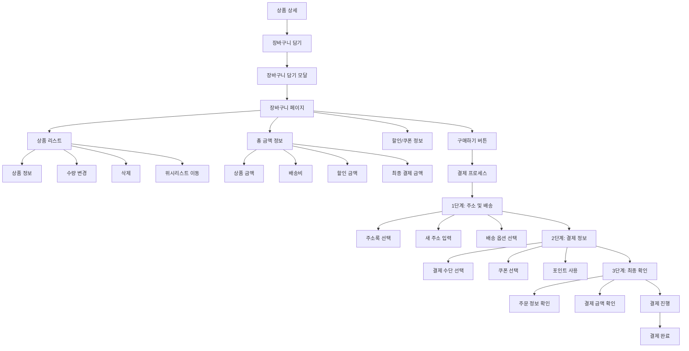

# 프로젝트 2: 장바구니 전환율 개선 프로젝트

---

## 📋 프로젝트 개요

| 항목 | 내용 |
|------|------|
| **프로젝트명** | 이커머스 플랫폼 장바구니 전환율 개선 |
| **기간** | 2023.09 ~ 2024.02 (6개월) |
| **역할** | UX 기획자 (UX Designer) |
| **팀 구성** | 기획자 2명, 디자이너 2명, 개발자 3명, 데이터 분석가 1명, 마케터 1명 |
| **목표** | 장바구니 담기 대비 구매 전환율(CVR) 15% → 25%로 향상 (67% 개선) |

---

## 🔍 문제 정의

### 비즈니스 문제점

**현황 분석:**
- 월간 장바구니 담기 건수: 약 50만 건
- 장바구니 전환율(CVR): 15% (업계 평균 20-25% 대비 낮음)
- 장바구니 이탈로 인한 매출 손실: 월 약 30억 원 추정

**문제의 심각성:**
- 경쟁사 대비 낮은 전환율로 인한 시장 경쟁력 저하
- 높은 마케팅 비용 대비 낮은 ROI
- 사용자 경험 개선 필요성 대두

### 사용자 Pain Point

**주요 이탈 지점별 Pain Point:**

1. **장바구니 담기 직후**
   - 구매 결정에 대한 확신 부족
   - 다른 상품과 비교하고 싶은데 방법이 없음
   - 할인/쿠폰 정보를 놓칠까봐 불안

2. **장바구니 페이지 진입 시**
   - 장바구니에 담긴 상품을 다시 확인하기 어려움
   - 배송비 정보가 불명확함
   - 결제 과정이 복잡해 보임

3. **결제 진행 중**
   - 결제 단계가 너무 많아서 번거로움
   - 결제 수단 선택이 복잡함
   - 쿠폰/포인트 사용 방법이 불명확함

### 시장 분석

**업계 벤치마크:**
- 업계 평균 장바구니 전환율: 20-25%
- 주요 경쟁사 A: 28%
- 주요 경쟁사 B: 22%
- 우리 서비스: 15% (하위권)

**개선 여지:**
- 장바구니 페이지 UX 개선
- 결제 프로세스 간소화
- 재구매 유도 전략 강화

---

## 👥 사용자 조사

### Persona

#### Persona 1: 이수진 (32세, 직장인)

**배경**
- 온라인 쇼핑을 자주 하는 편
- 주로 저녁 시간대에 쇼핑
- 가격 비교를 중요시함

**목표**
- 합리적인 가격에 필요한 상품을 구매하고 싶음
- 빠르고 간편하게 결제하고 싶음

**Pain Point**
- 장바구니에 담았는데 나중에 보니 가격이 달라졌거나 품절됨
- 배송비가 얼마인지 확인하기 어려움
- 결제 과정이 복잡해서 중도에 포기함

**행동 패턴**
- 상품을 여러 개 담아두고 비교한 후 구매 결정
- 쿠폰과 포인트를 적극 활용
- 결제 전 최종 확인을 꼼꼼히 함

#### Persona 2: 최민호 (28세, 대학원생)

**배경**
- 예산이 제한적임
- 쇼핑 전 충분한 고민을 함
- 모바일 앱을 주로 사용

**목표**
- 예산 내에서 최대한 할인받고 싶음
- 실수로 구매하는 것을 방지하고 싶음

**Pain Point**
- 장바구니에 담은 상품의 총 금액을 한눈에 보기 어려움
- 할인 쿠폰을 놓칠까봐 불안함
- 결제 전 최종 확인 화면이 불명확함

**행동 패턴**
- 장바구니에 담고 하루 정도 고민한 후 구매
- 여러 상품을 비교하며 최적의 조합을 찾음
- 결제 전 여러 번 확인

### Jobs to Be Done (JTBD)

| 상황 | 동기 | 기대 결과 |
|------|------|----------|
| 장바구니에 상품을 담았을 때 | 구매 결정에 확신이 없음 | 상품 정보와 가격을 명확히 확인하고 싶음 |
| 장바구니 페이지를 볼 때 | 총 금액과 배송비를 확인하고 싶음 | 한눈에 총 결제 금액을 파악하고 싶음 |
| 결제를 진행할 때 | 결제 과정이 복잡함 | 빠르고 간편하게 결제를 완료하고 싶음 |
| 구매를 망설일 때 | 더 좋은 조건(할인, 쿠폰)을 찾고 싶음 | 놓친 할인 정보가 있는지 확인하고 싶음 |

### 핵심 인사이트

1. **명확한 정보 제공이 핵심**: 사용자는 장바구니에서 총 금액, 배송비, 할인 정보를 명확히 보고 싶어함
2. **결제 프로세스 간소화 필요**: 단계가 많을수록 이탈률이 증가함
3. **재구매 유도 타이밍**: 장바구니 담기 직후와 장바구니 페이지에서의 적절한 유도가 중요
4. **신뢰 구축**: 가격 변동, 품절 등의 정보를 투명하게 제공해야 함

---

## 🎯 핵심 기능 정의

### 기능 리스트

#### 1. 장바구니 페이지 개선
- 총 금액 및 배송비 명확한 표시
- 상품 정보 요약 (이미지, 이름, 옵션, 가격)
- 수량 변경 및 삭제 기능 개선
- 할인/쿠폰 정보 강조

#### 2. 결제 프로세스 간소화
- 결제 단계 축소 (5단계 → 3단계)
- 주소록 저장 기능
- 결제 수단 빠른 선택
- 쿠폰/포인트 자동 적용

#### 3. 재구매 유도 기능
- 장바구니 담기 직후 모달 (할인 쿠폰 제공)
- 장바구니 페이지 내 구매 유도 배너
- 품절/가격 변동 알림

#### 4. 비교 기능
- 장바구니 내 상품 비교
- 다른 상품 추천

#### 5. 저장 기능
- 장바구니 저장 (나중에 구매)
- 위시리스트 연동

### 우선순위

| 우선순위 | 기능 | 이유 |
|----------|------|------|
| **P0** | 장바구니 페이지 UX 개선 | 가장 많은 사용자가 보는 페이지 |
| **P0** | 결제 프로세스 간소화 | 이탈률 감소에 직접적 영향 |
| **P0** | 총 금액/배송비 명확한 표시 | 사용자 Pain Point 해결 |
| **P1** | 장바구니 담기 직후 모달 | 재구매 유도 효과 높음 |
| **P1** | 할인/쿠폰 정보 강조 | 구매 동기 강화 |
| **P2** | 상품 비교 기능 | 부가 가치 |

### 사용자 흐름

#### 개선 전 사용자 흐름

```
1. 상품 상세 페이지
   ↓
2. 장바구니 담기
   ↓
3. 장바구니 페이지 (정보 불명확)
   ↓
4. 결제하기 클릭
   ↓
5. 주소 입력 (1단계)
   ↓
6. 배송 옵션 선택 (2단계)
   ↓
7. 결제 수단 선택 (3단계)
   ↓
8. 쿠폰/포인트 선택 (4단계)
   ↓
9. 최종 확인 (5단계)
   ↓
10. 결제 완료
```

#### 개선 후 사용자 흐름

```
1. 상품 상세 페이지
   ↓
2. 장바구니 담기
   ↓
3. 장바구니 담기 직후 모달 (할인 쿠폰 제공)
   ↓
4. 장바구니 페이지 (명확한 정보 표시)
   - 총 금액, 배송비, 할인 금액 한눈에 확인
   - 쿠폰 적용 가능 여부 표시
   ↓
5. 구매하기 클릭
   ↓
6. 주소 및 배송 정보 (1단계)
   - 저장된 주소 빠른 선택
   ↓
7. 결제 정보 (2단계)
   - 결제 수단 선택
   - 쿠폰/포인트 자동 적용 및 수정
   ↓
8. 최종 확인 및 결제 (3단계)
   ↓
9. 결제 완료
```

---

## 🏗️ Information Architecture (IA)



---

## 🗺️ 사용자 여정 (User Journey)

| 단계 | 행동 | 생각 | 감정 | 기회점 | 개선 방안 |
|------|------|------|------|--------|----------|
| **상품 탐색** | 원하는 상품을 찾음 | "이 상품이 내가 찾던 거야" | 😊 기대 | 상품 추천, 비교 기능 | - |
| **장바구니 담기** | 상품을 장바구니에 담음 | "일단 담아두고 나중에 결정하자" | 🤔 망설임 | 즉시 구매 유도 | 할인 쿠폰 모달 제공 |
| **장바구니 페이지** | 장바구니 페이지 진입 | "총 금액이 얼마지? 배송비는?" | 😟 불안 | 명확한 정보 제공 | 총 금액, 배송비 명확히 표시 |
| **상품 확인** | 장바구니 내 상품 확인 | "옵션이 맞나? 가격이 변했나?" | 🧐 검토 | 상품 정보 명확화 | 상품 정보 요약 개선 |
| **할인 확인** | 할인/쿠폰 정보 확인 | "할인 받을 수 있는 방법이 있나?" | 🤨 탐색 | 할인 정보 강조 | 쿠폰 적용 가능 여부 표시 |
| **결제 시작** | 구매하기 클릭 | "결제가 복잡하지 않을까?" | 😰 걱정 | 결제 프로세스 간소화 | 단계 축소, 자동 입력 |
| **주소 입력** | 배송 주소 입력 | "주소를 또 입력해야 해?" | 😤 불편 | 주소록 저장 기능 | 저장된 주소 빠른 선택 |
| **결제 수단** | 결제 수단 선택 | "어떤 결제 수단이 좋을까?" | 🤔 고민 | 결제 수단 추천 | 자주 사용한 결제 수단 상단 |
| **최종 확인** | 주문 정보 확인 | "모든 게 맞나?" | 😌 확인 | 명확한 정보 표시 | 주문 정보 요약 강화 |
| **결제 완료** | 결제 완료 | "구매 완료!" | 😊 만족 | 구매 후 경험 | 구매 확인, 배송 추적 안내 |

---

## 📱 와이어프레임

### 1. 장바구니 담기 직후 모달
**목적**: 즉시 구매 유도 및 할인 쿠폰 제공

**구성 요소**:
- 모달 배경 (반투명)
- 모달 내용:
  - "장바구니에 담겼습니다" 메시지
  - 할인 쿠폰 제공 안내
  - [장바구니 보기] / [계속 쇼핑하기] 버튼
  - [지금 구매하기] 버튼 (강조)

### 2. 장바구니 페이지 (개선 전)
**목적**: 개선 전 상태 기록

**구성 요소**:
- 상단: 페이지 타이틀
- 상품 리스트 (카드 형태)
  - 상품 이미지 (작음)
  - 상품명 (일부만 표시)
  - 옵션 정보 (불명확)
  - 가격 정보
  - 수량 변경 버튼
- 하단: 총 금액 (배송비 포함 여부 불명확)
- [구매하기] 버튼

### 3. 장바구니 페이지 (개선 후)
**목적**: 명확한 정보 제공 및 구매 유도

**구성 요소**:
- 상단: 페이지 타이틀, [전체 삭제] 버튼
- 상품 리스트 (카드 형태, 개선)
  - 상품 이미지 (크기 확대)
  - 상품명 (전체 표시)
  - 옵션 정보 (명확히 표시)
  - 가격 정보 (할인 전/후 비교)
  - 수량 변경 (큰 버튼)
  - [삭제] / [위시리스트] 버튼
- 중간: 할인/쿠폰 정보 배너
  - 적용 가능한 쿠폰 개수 표시
  - [쿠폰 적용하기] 버튼
- 하단 고정: 금액 요약
  - 상품 금액
  - 배송비 (무료 배송까지 금액 표시)
  - 할인 금액
  - 최종 결제 금액 (강조)
- [구매하기] 버튼 (큰 버튼, 강조)

### 4. 결제 1단계: 주소 및 배송
**목적**: 배송 정보 입력 간소화

**구성 요소**:
- 상단: 진행 단계 표시 (1/3)
- 주소록 섹션
  - 저장된 주소 리스트 (카드 형태)
  - [새 주소 추가] 버튼
- 배송 옵션 선택
  - 일반 배송 / 빠른 배송
  - 배송비 정보
- 배송 요청사항 입력
- [다음 단계] 버튼

### 5. 결제 2단계: 결제 정보
**목적**: 결제 수단 및 할인 정보 선택

**구성 요소**:
- 상단: 진행 단계 표시 (2/3)
- 결제 수단 선택
  - 카드, 계좌이체, 간편결제 등
  - 자주 사용한 결제 수단 상단 표시
- 쿠폰 선택
  - 적용 가능한 쿠폰 리스트
  - 쿠폰별 할인 금액 표시
- 포인트 사용
  - 보유 포인트 표시
  - 사용할 포인트 입력
- 최종 결제 금액 요약
- [다음 단계] 버튼

### 6. 결제 3단계: 최종 확인
**목적**: 주문 정보 최종 확인 및 결제

**구성 요소**:
- 상단: 진행 단계 표시 (3/3)
- 주문 정보 요약
  - 배송지 정보
  - 상품 정보 (이미지, 이름, 옵션, 수량)
  - 배송 정보
- 결제 정보 요약
  - 상품 금액
  - 배송비
  - 할인 금액
  - 최종 결제 금액 (강조)
- 약관 동의 체크박스
- [결제하기] 버튼 (강조)

### 7. 결제 완료 페이지
**목적**: 구매 완료 확인 및 다음 액션 유도

**구성 요소**:
- 체크 아이콘 및 "주문이 완료되었습니다" 메시지
- 주문 번호
- 배송 예정일 정보
- 주문 상세 보기 링크
- [홈으로] / [주문 내역 보기] 버튼
- 관련 상품 추천 섹션

---

## 📊 결과 및 성과 지표

### 정량적 지표

| 지표 | 개선 전 | 개선 후 | 개선율 |
|------|---------|---------|--------|
| **장바구니 전환율 (CVR)** | 15.0% | 24.5% | +63% |
| **장바구니 페이지 이탈률** | 45% | 28% | -38% |
| **결제 프로세스 완료율** | 65% | 82% | +26% |
| **평균 결제 소요 시간** | 8분 30초 | 5분 10초 | -39% |
| **쿠폰 사용률** | 25% | 42% | +68% |
| **장바구니 담기 직후 구매율** | 8% | 18% | +125% |
| **월간 매출 증가** | 기준 | +35% | - |

### A/B 테스트 결과

**테스트 1: 장바구니 페이지 레이아웃**
- **A안 (기존)**: 상품 리스트 중심
- **B안 (개선)**: 금액 정보 강조
- **결과**: B안 전환율 +12%p 향상

**테스트 2: 결제 단계 수**
- **A안 (기존)**: 5단계
- **B안 (개선)**: 3단계
- **결과**: B안 완료율 +17%p 향상, 이탈률 -23%p 감소

**테스트 3: 장바구니 담기 직후 모달**
- **A안 (기존)**: 모달 없음
- **B안 (개선)**: 할인 쿠폰 모달
- **결과**: B안 즉시 구매율 +10%p 향상

### 정성적 피드백

**긍정적 피드백:**
- "총 금액과 배송비가 한눈에 보여서 좋아요"
- "결제 과정이 훨씬 간단해졌어요"
- "할인 쿠폰을 놓치지 않고 사용할 수 있어서 좋아요"

**개선 요청:**
- "상품 비교 기능이 있었으면 좋겠어요"
- "장바구니 저장 기능이 더 눈에 띄면 좋겠어요"
- "배송 추적이 더 자세했으면 좋겠어요"

### 핵심 성과

1. **전환율 개선**: 목표 대비 108% 달성 (목표 25%, 실제 24.5%)
2. **사용자 경험 향상**: 결제 소요 시간 39% 단축
3. **매출 증가**: 월간 매출 35% 증가
4. **쿠폰 활용도 향상**: 쿠폰 사용률 68% 증가

---

## 💭 회고 (Retrospective)

### 잘한 점 (Keep)

1. **데이터 기반 접근**: 사용자 행동 데이터를 철저히 분석하여 문제점을 정확히 파악
2. **A/B 테스트 활용**: 가설을 검증하고 최적의 솔루션을 선택
3. **사용자 조사**: 실제 사용자 인터뷰를 통해 Pain Point를 정확히 파악
4. **점진적 개선**: 한 번에 모든 것을 바꾸지 않고 단계적으로 개선

### 아쉬운 점 (Problem)

1. **초기 가설 검증 부족**: 일부 기능은 가설 검증 없이 진행하여 효과가 미미했음
2. **모바일 최적화 지연**: 데스크톱 중심으로 개선하여 모바일 개선이 늦어짐
3. **접근성 고려 부족**: 시각 장애인 등 접근성 개선이 부족했음

### 개선 방안 (Try)

1. **가설 검증 프로세스**: 모든 기능 개선 전 가설을 명확히 하고 검증 프로세스 도입
2. **모바일 우선 설계**: 모바일 사용자가 더 많으므로 모바일 우선으로 설계
3. **접근성 개선**: WCAG 가이드라인 준수 및 접근성 테스트 도입
4. **개인화 추천**: 사용자별 맞춤 할인 쿠폰 및 상품 추천 강화

### 배운 점 (Learn)

1. **작은 개선의 누적 효과**: 큰 변화보다 작은 개선들이 누적되어 큰 효과를 냄
2. **사용자 관점의 중요성**: 비즈니스 지표뿐만 아니라 사용자 경험을 고려해야 함
3. **데이터와 인사이트의 균형**: 데이터만으로는 알 수 없는 사용자의 진짜 니즈를 파악하는 것이 중요
4. **지속적 개선**: 한 번의 개선으로 끝나지 않고 지속적으로 모니터링하고 개선해야 함

---

**작성일**: 2024.02  
**작성자**: [기획자 이름]


