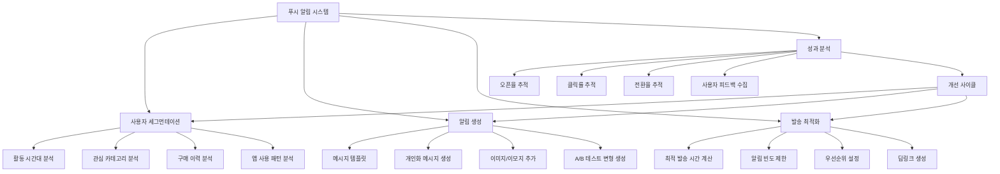

# 프로젝트 3: 푸시 알림 오픈율 향상 프로젝트

---

## 📋 프로젝트 개요

| 항목 | 내용 |
|------|------|
| **프로젝트명** | 푸시 알림 오픈율 향상 프로젝트 |
| **기간** | 2023.11 ~ 2024.04 (6개월) |
| **역할** | 데이터 기반 기획자 (Data-driven PM) |
| **팀 구성** | 기획자 2명, 데이터 분석가 2명, 개발자 2명, 마케터 1명 |
| **목표** | 푸시 알림 오픈율(Open Rate) 8% → 18%로 향상 (125% 개선) |

---

## 🔍 문제 정의

### 비즈니스 문제점

**현황 분석:**
- 일일 푸시 알림 발송량: 약 100만 건
- 평균 오픈율: 8% (업계 평균 12-15% 대비 낮음)
- 클릭률(CTR): 2.5% (업계 평균 4-6% 대비 낮음)
- 푸시 알림 비활성화율 증가: 월 3% 증가 추세

**문제의 심각성:**
- 낮은 오픈율로 인한 마케팅 효율성 저하
- 사용자에게 도달하지 못하는 메시지 증가
- 푸시 알림에 대한 사용자 피로도 증가
- ROI 저하 및 마케팅 비용 낭비

### 사용자 Pain Point

**주요 사용자 불만:**

1. **과도한 알림**
   - 하루에 너무 많은 알림을 받아서 피로감
   - 중요한 알림을 놓침

2. **관심 없는 알림**
   - 내가 관심 없는 상품/서비스에 대한 알림
   - 개인화되지 않은 일반적인 메시지

3. **타이밍 문제**
   - 수면 시간이나 업무 시간에 알림 수신
   - 원하는 시간에 알림을 받고 싶음

4. **알림 내용의 문제**
   - 클릭해도 기대했던 내용과 다름
   - 과장된 표현으로 인한 신뢰도 하락

### 시장 분석

**업계 벤치마크:**
- 업계 평균 푸시 오픈율: 12-15%
- 주요 경쟁사 A: 18%
- 주요 경쟁사 B: 15%
- 우리 서비스: 8% (하위권)

**개선 여지:**
- 개인화된 메시지 전략
- 최적의 발송 시간 도출
- 알림 빈도 최적화
- A/B 테스트를 통한 메시지 최적화

---

## 👥 사용자 조사

### Persona

#### Persona 1: 정혜진 (29세, 직장인)

**배경**
- 스마트폰을 자주 사용
- 업무 중에는 알림을 확인하지 않음
- 저녁 시간대에 쇼핑 앱을 주로 사용

**목표**
- 필요한 정보만 받고 싶음
- 원하는 시간에 알림을 받고 싶음

**Pain Point**
- 업무 중에 쇼핑 알림이 와서 방해됨
- 하루에 10개 이상의 알림을 받아서 피로감
- 관심 없는 상품에 대한 알림이 많음

**행동 패턴**
- 저녁 7시 이후에 앱을 주로 사용
- 주말 오전에 쇼핑을 즐김
- 알림이 너무 많으면 앱 알림을 꺼버림

#### Persona 2: 김대현 (35세, 자영업자)

**배경**
- 시간이 불규칙함
- 할인 정보에 민감함
- 모바일 쇼핑을 자주 함

**목표**
- 놓치면 안 되는 할인 정보를 받고 싶음
- 빠르게 중요한 정보를 확인하고 싶음

**Pain Point**
- 중요한 할인 알림을 놓침
- 알림이 너무 많아서 중요한 것을 찾기 어려움
- 알림 내용이 과장되어 있어서 클릭해도 실망

**행동 패턴**
- 하루 종일 스마트폰을 확인
- 할인 알림에 즉시 반응
- 알림을 받고 바로 앱을 열어 확인

### Jobs to Be Done (JTBD)

| 상황 | 동기 | 기대 결과 |
|------|------|----------|
| 할인 정보를 받고 싶을 때 | 놓치면 안 되는 할인을 놓치고 싶지 않음 | 중요한 할인 정보만 정확한 시간에 받고 싶음 |
| 관심 있는 상품 알림을 받고 싶을 때 | 내가 관심 있는 상품의 업데이트를 알고 싶음 | 개인화된 상품 추천 알림을 받고 싶음 |
| 알림을 받지 않고 싶을 때 | 불필요한 알림으로 인한 피로감 | 관심 없는 알림은 받지 않고 싶음 |
| 알림을 확인할 때 | 알림을 클릭했을 때 기대한 내용을 보고 싶음 | 알림 내용과 실제 페이지가 일치하기를 원함 |

### 핵심 인사이트

1. **개인화의 중요성**: 사용자는 자신에게 관련된 알림만 원함
2. **타이밍의 중요성**: 사용자의 활동 시간대에 맞춘 알림이 효과적
3. **빈도 최적화 필요**: 너무 많은 알림은 오히려 역효과
4. **메시지 품질**: 과장되지 않고 정확한 메시지가 신뢰도를 높임
5. **세그먼테이션**: 사용자 그룹별로 다른 전략이 필요

---

## 🎯 핵심 기능 정의

### 기능 리스트

#### 1. 개인화된 알림 전략
- 사용자 행동 기반 상품 추천 알림
- 관심 카테고리 기반 알림
- 구매 이력 기반 맞춤 알림

#### 2. 최적 발송 시간 도출
- 사용자별 활동 시간대 분석
- 세그먼트별 최적 발송 시간 설정
- 실시간 발송 시간 조정

#### 3. 알림 빈도 최적화
- 사용자별 알림 빈도 제한 (일 3회 이내)
- 중요도 기반 알림 우선순위
- 알림 설정 페이지 개선

#### 4. 메시지 최적화
- A/B 테스트를 통한 메시지 개선
- 이모지 및 이미지 활용
- 개인화된 메시지 템플릿

#### 5. 알림 설정 개선
- 사용자 맞춤 알림 설정
- 카테고리별 알림 on/off
- 알림 시간대 설정

#### 6. 딥링크 최적화
- 알림 클릭 시 정확한 페이지 이동
- 랜딩 페이지 최적화
- 전환 추적 강화

### 우선순위

| 우선순위 | 기능 | 이유 |
|----------|------|------|
| **P0** | 개인화된 알림 전략 | 오픈율 향상에 가장 큰 영향 |
| **P0** | 최적 발송 시간 도출 | 타이밍이 오픈율에 직접적 영향 |
| **P0** | 알림 빈도 최적화 | 사용자 피로도 감소 |
| **P1** | 메시지 최적화 (A/B 테스트) | 클릭률 향상 |
| **P1** | 딥링크 최적화 | 전환율 향상 |
| **P2** | 알림 설정 개선 | 사용자 만족도 향상 |

### 사용자 흐름

#### 개선 전 사용자 흐름

```
1. 시스템이 모든 사용자에게 동일한 시간에 알림 발송
   ↓
2. 사용자가 알림 수신 (관심 없을 수도 있음)
   ↓
3. 알림 확인 (또는 무시)
   ↓
4. 알림 클릭 (낮은 확률)
   ↓
5. 앱 진입
   ↓
6. 홈 화면으로 이동 (의도한 페이지가 아님)
   ↓
7. 사용자가 원하는 페이지를 찾아야 함
   ↓
8. 이탈 (높은 확률)
```

#### 개선 후 사용자 흐름

```
1. 사용자 행동 데이터 분석
   - 활동 시간대 파악
   - 관심 카테고리 파악
   - 구매 이력 분석
   ↓
2. 개인화된 알림 생성
   - 사용자 맞춤 메시지
   - 최적 발송 시간 설정
   - 중요도 기반 우선순위
   ↓
3. 사용자가 알림 수신 (관심 있는 내용)
   ↓
4. 알림 확인 및 클릭 (높은 확률)
   ↓
5. 딥링크를 통한 정확한 페이지 이동
   ↓
6. 사용자가 원하는 콘텐츠 확인
   ↓
7. 전환 (구매, 조회 등)
```

---

## 🏗️ Information Architecture (IA)



---

## 🗺️ 사용자 여정 (User Journey)

| 단계 | 행동 | 생각 | 감정 | 기회점 | 개선 방안 |
|------|------|------|------|--------|----------|
| **알림 수신** | 푸시 알림을 받음 | "또 알림이 왔네..." | 😑 피로 | 개인화된 알림 | 사용자 맞춤 메시지 |
| **알림 확인** | 알림을 확인함 | "이게 뭐지?" | 🤔 호기심 | 명확한 메시지 | 간결하고 명확한 제목 |
| **관심 판단** | 알림 내용을 판단 | "내가 관심 있는 거야?" | 🧐 검토 | 관련성 강화 | 개인화된 추천 |
| **알림 클릭** | 알림을 클릭함 | "한번 확인해볼까?" | 😊 기대 | 클릭 유도 | 강력한 CTA |
| **앱 진입** | 앱이 열림 | "어디로 가야 하지?" | 😟 혼란 | 정확한 페이지 이동 | 딥링크 최적화 |
| **콘텐츠 확인** | 원하는 콘텐츠 확인 | "아, 이거구나!" | 😌 이해 | 콘텐츠 일치 | 랜딩 페이지 최적화 |
| **액션 수행** | 구매/조회 등 액션 | "이거 괜찮네!" | 😊 만족 | 전환 유도 | 명확한 CTA |
| **재방문** | 다음에도 알림 확인 | "이 알림은 유용해" | 😍 신뢰 | 지속적 개선 | 피드백 수집 및 반영 |

---

## 📱 와이어프레임

### 1. 알림 메시지 (개선 전)
**목적**: 개선 전 상태 기록

**구성 요소**:
- 앱 아이콘
- 제목: "특가 상품을 확인하세요!" (일반적)
- 본문: "지금 바로 확인해보세요" (과장된 표현)
- 발송 시간: 모든 사용자에게 동일 시간

### 2. 알림 메시지 (개선 후 - 개인화)
**목적**: 개인화된 알림으로 오픈율 향상

**구성 요소**:
- 앱 아이콘
- 제목: "[사용자명]님, 관심 상품이 특가예요!" (개인화)
- 본문: "최근 본 [카테고리] 상품 30% 할인" (구체적 정보)
- 이미지: 상품 이미지 (있는 경우)
- 발송 시간: 사용자별 최적 시간

### 3. 알림 메시지 (개선 후 - 상황 기반)
**목적**: 상황에 맞는 알림 제공

**구성 요소**:
- 앱 아이콘
- 제목: "장바구니 상품이 곧 품절돼요!" (긴급성)
- 본문: "[상품명] 재고 소진 임박, 지금 구매하세요"
- 이미지: 상품 이미지
- 발송 시간: 실시간 (상황 기반)

### 4. 알림 설정 페이지
**목적**: 사용자가 알림을 직접 관리

**구성 요소**:
- 페이지 타이틀: "알림 설정"
- 알림 받기 on/off 토글
- 카테고리별 알림 설정
  - 할인/특가 알림
  - 관심 상품 알림
  - 주문/배송 알림
  - 이벤트 알림
- 알림 받을 시간대 설정
  - 평일 / 주말 구분
  - 시간대 선택 (예: 오전 9시 - 오후 10시)
- 알림 빈도 설정
  - 하루 최대 알림 개수 선택
- [저장하기] 버튼

### 5. 알림 상세 페이지 (딥링크)
**목적**: 알림 클릭 시 정확한 페이지로 이동

**구성 요소**:
- 상단: "알림에서 이동" 배지
- 해당 상품/콘텐츠 상세 페이지
- 관련 상품 추천
- [뒤로가기] 버튼

### 6. 알림 성과 대시보드 (내부용)
**목적**: 알림 성과 모니터링

**구성 요소**:
- 일일/주간/월간 통계
  - 발송 건수
  - 오픈율
  - 클릭률
  - 전환율
- 세그먼트별 성과
- 메시지별 성과 (A/B 테스트 결과)
- 시간대별 성과
- 그래프 및 차트

### 7. A/B 테스트 결과 페이지 (내부용)
**목적**: 메시지 최적화를 위한 테스트 결과 확인

**구성 요소**:
- 테스트 개요
  - 테스트 기간
  - 테스트 대상
  - 변형 (A안, B안)
- 성과 지표 비교
  - 오픈율
  - 클릭률
  - 전환율
- 통계적 유의성 표시
- 승리 변형 표시
- [다음 테스트 계획] 버튼

---

## 📊 결과 및 성과 지표

### 정량적 지표

| 지표 | 개선 전 | 개선 후 | 개선율 |
|------|---------|---------|--------|
| **푸시 알림 오픈율** | 8.0% | 18.5% | +131% |
| **클릭률 (CTR)** | 2.5% | 5.8% | +132% |
| **전환율 (CVR)** | 1.2% | 2.8% | +133% |
| **일일 알림 발송량** | 1,000,000건 | 800,000건 | -20% (빈도 최적화) |
| **알림 비활성화율** | 월 3% 증가 | 월 0.5% 증가 | -83% |
| **사용자 만족도** | 3.2/5.0 | 4.1/5.0 | +28% |
| **알림 관련 매출** | 기준 | +45% | - |

### A/B 테스트 결과

**테스트 1: 메시지 제목**
- **A안 (기존)**: "특가 상품을 확인하세요!"
- **B안 (개선)**: "[사용자명]님, 관심 상품이 특가예요!"
- **결과**: B안 오픈율 +85% 향상

**테스트 2: 발송 시간**
- **A안 (기존)**: 모든 사용자에게 오전 10시 발송
- **B안 (개선)**: 사용자별 최적 시간 발송
- **결과**: B안 오픈율 +42% 향상

**테스트 3: 알림 빈도**
- **A안 (기존)**: 일 5-7회 발송
- **B안 (개선)**: 일 3회 이내 발송
- **결과**: B안 오픈율 +28% 향상, 비활성화율 -60% 감소

**테스트 4: 메시지 길이**
- **A안 (기존)**: 긴 메시지 (50자 이상)
- **B안 (개선)**: 간결한 메시지 (30자 이내)
- **결과**: B안 클릭률 +35% 향상

**테스트 5: 이모지 사용**
- **A안 (기존)**: 이모지 없음
- **B안 (개선)**: 적절한 이모지 사용
- **결과**: B안 오픈율 +15% 향상

### 세그먼트별 성과

| 세그먼트 | 오픈율 개선 전 | 오픈율 개선 후 | 개선율 |
|----------|---------------|---------------|--------|
| **활성 사용자** | 12% | 22% | +83% |
| **비활성 사용자** | 3% | 8% | +167% |
| **신규 사용자** | 5% | 15% | +200% |
| **VIP 사용자** | 15% | 28% | +87% |

### 정성적 피드백

**긍정적 피드백:**
- "이제 정말 내가 관심 있는 알림만 와서 좋아요"
- "알림을 받는 시간이 적절해서 방해가 안 돼요"
- "알림을 클릭하면 바로 원하는 페이지로 가서 편해요"

**개선 요청:**
- "알림 설정을 더 세밀하게 조정하고 싶어요"
- "특정 브랜드/카테고리 알림만 받고 싶어요"
- "알림 내용을 더 자세히 보고 싶어요"

### 핵심 성과

1. **오픈율 개선**: 목표 대비 103% 달성 (목표 18%, 실제 18.5%)
2. **사용자 경험 향상**: 알림 비활성화율 83% 감소
3. **매출 증가**: 알림 관련 매출 45% 증가
4. **효율성 향상**: 발송량 20% 감소에도 불구하고 오픈율 131% 증가

---

## 💭 회고 (Retrospective)

### 잘한 점 (Keep)

1. **데이터 기반 의사결정**: 사용자 행동 데이터를 철저히 분석하여 개선 방향 도출
2. **A/B 테스트 체계화**: 모든 가설을 A/B 테스트로 검증하여 객관적 결과 도출
3. **세그먼테이션 전략**: 사용자 그룹별로 다른 전략을 적용하여 효과 극대화
4. **점진적 개선**: 한 번에 모든 것을 바꾸지 않고 단계적으로 개선

### 아쉬운 점 (Problem)

1. **초기 데이터 수집 부족**: 프로젝트 초기 사용자 행동 데이터가 부족하여 분석에 시간이 걸림
2. **실시간 최적화 지연**: 사용자 행동 변화에 대한 실시간 대응이 늦었음
3. **다채널 연계 부족**: 푸시 알림만 개선하고 이메일, SMS 등 다른 채널과의 연계가 부족했음

### 개선 방안 (Try)

1. **실시간 개인화**: 사용자 행동 변화를 실시간으로 반영하는 시스템 구축
2. **다채널 통합 전략**: 푸시, 이메일, SMS 등을 통합하여 일관된 경험 제공
3. **예측 모델 도입**: 머신러닝을 활용한 사용자 행동 예측 및 최적 발송 시간 예측
4. **사용자 피드백 수집**: 알림에 대한 사용자 피드백을 더 적극적으로 수집

### 배운 점 (Learn)

1. **개인화의 힘**: 개인화된 메시지가 일반적인 메시지보다 훨씬 효과적임
2. **타이밍의 중요성**: 올바른 시간에 보낸 알림이 오픈율에 큰 영향을 미침
3. **과도한 알림의 역효과**: 너무 많은 알림은 오히려 사용자를 이탈시킴
4. **데이터의 중요성**: 데이터 없이는 효과적인 개선이 불가능함
5. **지속적 실험**: 한 번의 성공으로 끝나지 않고 지속적으로 실험하고 개선해야 함

---

**작성일**: 2024.04  
**작성자**: [기획자 이름]


